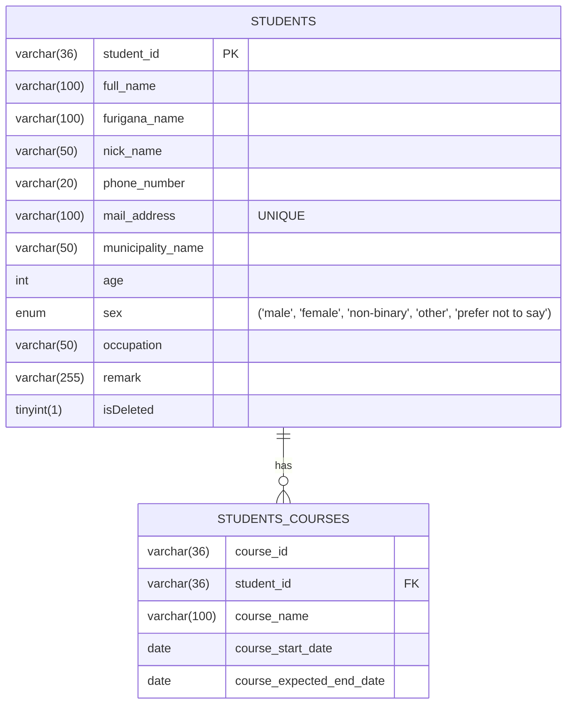

# 受講生管理システム（Student Management System）

ポートフォリオ用に作成した、受講生情報と受講コースを管理するREST APIアプリケーションです。  
現在はAPIのみの構成ですが、PostmanやSwagger UIを使って各機能の動作を確認できるようにしています。  
Java / Spring Boot / MyBatis / MySQL を使用し、API仕様書、バリデーション、例外処理なども実装済みです。

※本アプリは現在も開発途中のプロジェクトです。  
今後、テスト実装や機能拡張・デプロイを予定しています。（詳細は、今後追加したい機能の項目に記述)

---

## 概要（What）

スクール運営者が、受講生の基本情報（氏名、連絡先、年齢等）とコース情報（受講コース、開始日、終了予定日等）を一元的に管理することができるアプリケーションです。  
情報の登録・更新・取得・削除（論理削除）といった、基本的な操作を行うことができます。

## 作成背景（Why）

Java / Spring Boot / MyBatis / MySQL などの学習成果を形にするために作成しています。  
本アプリは、以下のような課題を解決するために開発しています：

- 受講生情報とコース情報が別々に管理されており、整合性の維持が困難
- 複数コース受講者に対応する際、情報の紐づけが煩雑になりやすい
- Excelなどの表計算ソフトでは、検索・抽出・一括更新などのデータ活用に限界がある
- 手作業による管理が中心となり、入力ミスや重複登録などのヒューマンエラーが発生しやすい

このシステムにより、受講生情報とコース情報を一元的に管理し、より正確かつ効率的な運営が可能になります。

## 使用技術・技術スタック

実務で頻繁に使用されていると耳にする、以下の技術やツールを採用しています。

- 言語: Java 21
- フレームワーク: Spring Boot 3.2.4
- データベース: MySQL 8.0.39
- ORマッパー: MyBatis
- その他: Swagger UI / Postman / IntelliJ / GitHub

## 機能一覧（Features）

| 機能名             | 詳細                                                  |
|-----------------|-----------------------------------------------------|
| 受講生詳細【登録】       | 受講生情報と受講生コース情報をセットで登録します（IDはUUIDで自動生成）              |
| 受講生詳細【一覧取得】     | 受講生の詳細情報を一覧取得します（論理削除済みの受講生を除く）                     |
| 受講生詳細【一覧取得（全件）】 | すべての受講生の詳細情報を一覧取得します（論理削除済みの受講生を含む）                 |
| 受講生詳細【個別取得】     | 受講生IDを指定し、対象の受講生の詳細情報を取得します（論理削除済みの受講生を含む）          |
| 受講生コース情報【一覧取得】  | すべての受講生のコース情報を取得します（論理削除済みの受講生を含む）。コース名による絞り込みも可能です 
| 受講生詳細【更新】       | 受講生の詳細情報を更新します。論理削除状態 (削除済みフラグ) の更新も可能です            |

※ 言葉の定義は以下のとおりです

- 受講生情報：氏名、連絡先、年齢、性別などの受講生の情報
- 受講生コース情報：受講コース名、コース開始日、コース終了予定日などのコース情報
- 受講生詳細：受講生情報 + 受講生コース情報 を組み合わせた情報（1対多の関係）
- 論理削除：`isDeleted` フラグを使って「削除済み」として扱い、データベース上からは削除しません

## セットアップ手順（How to Run）

詳細は後日追記します

## デプロイURL（Live Demo）

現時点では未デプロイです。
(将来的には、AWSを活用し、アプリケーションを公開することも検討しています)

## スクリーンショット・GIF

Swagger UIや実行結果の画像を貼る予定

## ER図（Mermaid形式）

本アプリでは、1人の受講生が複数のコースを受講できるよう、`students` テーブルと `students_courses`
テーブルを**1対多の関係**で設計しています。  
`students_courses` は、受講生IDをキーにしてコース情報を紐づける中間テーブルとして機能し、
受講生ごとのコース情報（コース名、開始日、終了予定日など）を管理しています。

下記は、その関係性と各テーブルの構造を示した簡易ER図です。

## シーケンス図

後日追記予定です。

## API設計（エンドポイント一覧）

| HTTPメソッド | URL                   | 処理内容                                  |
|----------|-----------------------|---------------------------------------|
| POST     | /students             | 受講生詳細情報【登録】                           |
| GET      | /students             | 受講生詳細情報【一覧取得】（論理削除済みの受講生を除く）          |
| GET      | /students/details     | 受講生詳細情報【一覧取得（全件）】（論理削除済みの受講生を含む）      |
| GET      | /students/{studentId} | 受講生詳細情報【個別取得】（論理削除済みの受講生を含む）          |
| PUT      | /students             | 受講生詳細情報【更新】                           |
| GET      | /courses              | 受講生コース情報【一覧取得】（コース名指定可・論理削除済みの受講生を含む） |
| GET      | /exception            | 例外処理の動作確認用                            |

## 工夫した点

- **複数コース受講への対応** 
  1人の受講生が複数のコースを受講できるように、中間テーブル（student_courses）を設計しました。  
  また、受講生とコース情報をセットで返すために `StudentDetail` クラスを用意し、APIのレスポンスを見やすく統合表示できるようにしました。

- **コース日付の自動補完** 
  コース開始日や終了予定日が未入力だった場合に、開始日を登録日で補い、終了予定日は自動的に「開始日＋1年」となるよう実装しました。
  これにより、ユーザーの手入力の手間を減らし、データの一貫性も保てるようにしています。

- **バリデーションと例外レスポンスの整備** 
  未入力や形式エラーに対するチェック（電話番号やメール形式など）を実装し、例外時には統一されたレスポンス形式でエラー情報を返すようにしました。

- **論理削除の導入**   削除済みデータを `isDeleted`
  フラグでDBに保持しつつ、必要に応じて「表示する/しない」を切り替えられる柔軟な設計にしました。

- **コミットメッセージやPRの見やすさを意識** 
  作業単位でコミットを細かく分け、メッセージには変更理由や意図を明記するようにしました。PRの内容も整理して、他人が見ても理解しやすいように心がけました。

---

## 将来の展望（Future Outlook）

- **検索条件の追加対応** 
  年齢・性別・コース名などによる詳細な絞り込み検索の実装を予定しています。

- **申込み状況の表示機能** 
  現在の受講ステータス（申込済／キャンセルなど）を表示する機能を追加予定です。

- **コース日付のバリデーション強化** 
  終了予定日が開始日より前の場合にエラーを返すよう、バリデーションまたは例外処理を導入予定です。

- **例外処理の追加** 
  コース名が存在しない場合のエラー（`CourseNotFoundException`）を `/courses`
  のエンドポイントでも処理するかどうか、今後の使用用途に応じて判断します。

- **READMEの強化** 
  アプリケーション構成図、処理フロー（シーケンス図）などの図解を追加し、設計意図をより視覚的に伝えられるREADMEを目指します。

- **単体テストの導入** 
  JUnitなどを活用し、単体テストや結合テストについて学習予定です。  
  学んだ内容を活かして、実際にテストコードを書けるようになることを目指しています。

- **フロントエンドの実装** 
  現在はAPIのみですが、今後は画面上から受講生の登録や検索などができるように、フロント側の開発にも取り組みたいと考えています。

- **AWSによるデプロイ** 
  将来的にはAWSを活用して、アプリケーションをクラウド環境に公開することも検討しています。

---

各セクションは今後随時更新予定です。
まずはドラフトとして公開し、改善と追加を重ねていきます。
