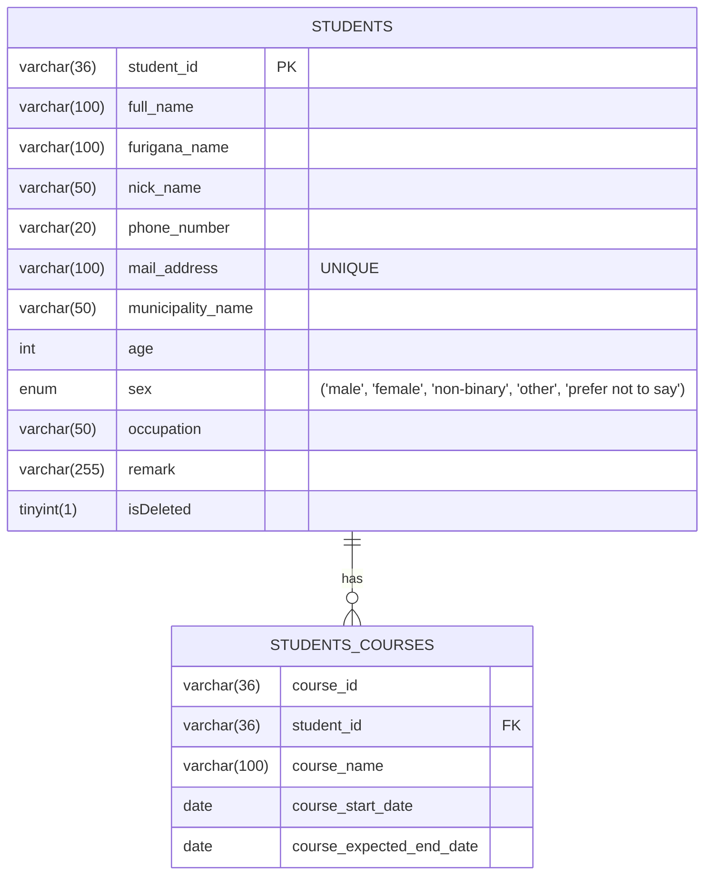

# 受講生管理システム（Student Management System）

ポートフォリオ用に作成した、受講生情報と受講コースを管理するREST APIアプリケーションです。  
現在はAPIのみの構成ですが、PostmanやSwagger UIを使って各機能の動作を確認できるようにしています。  
Java / Spring Boot / MyBatis / MySQL を使用し、API仕様書、バリデーション、例外処理なども実装済みです。

※本アプリは現在も開発途中のプロジェクトです。  
今後、テスト実装や機能拡張・デプロイを予定しています。（詳細は、今後追加したい機能の項目に記述)

---

## 概要（What）

スクール運営者が、受講生の基本情報（氏名、連絡先、年齢等）とコース情報（受講コース、開始日、終了予定日等）を一元的に管理することができるアプリケーションです。  
情報の登録・更新・取得・削除（論理削除）といった、基本的な操作を行うことができます。

## 作成背景（Why）

Java / Spring Boot / MyBatis / MySQL などの学習成果を形にするために作成しています。  
本アプリは、以下のような課題を解決するために開発しています：

- 受講生情報とコース情報が別々に管理されており、整合性の維持が困難
- 複数コース受講者に対応する際、情報の紐づけが煩雑になりやすい
- Excelなどの表計算ソフトでは、検索・抽出・一括更新などのデータ活用に限界がある
- 手作業による管理が中心となり、入力ミスや重複登録などのヒューマンエラーが発生しやすい

このシステムにより、受講生情報とコース情報を一元的に管理し、より正確かつ効率的な運営が可能になります。

## 使用技術・技術スタック

実務で頻繁に使用されていると耳にする、以下の技術やツールを採用しています。

- 言語: Java 21
- フレームワーク: Spring Boot 3.2.4
- データベース: MySQL 8.0.39
- ORマッパー: MyBatis
- その他: Swagger UI / Postman / IntelliJ IDEA / GitHub

## 機能一覧（Features）

| 機能名             | 詳細                                                  |
|-----------------|-----------------------------------------------------|
| 受講生詳細【登録】       | 受講生情報と受講生コース情報をセットで登録します（IDはUUIDで自動生成）              |
| 受講生詳細【一覧取得】     | 受講生の詳細情報を一覧取得します（論理削除済みの受講生を除く）                     |
| 受講生詳細【一覧取得（全件）】 | すべての受講生の詳細情報を一覧取得します（論理削除済みの受講生を含む）                 |
| 受講生詳細【個別取得】     | 受講生IDを指定し、対象の受講生の詳細情報を取得します（論理削除済みの受講生を含む）          |
| 受講生コース情報【一覧取得】  | すべての受講生のコース情報を取得します（論理削除済みの受講生を含む）。コース名による絞り込みも可能です 
| 受講生詳細【更新】       | 受講生の詳細情報を更新します。論理削除状態 (削除済みフラグ) の更新も可能です            |

※ 言葉の定義は以下のとおりです

- 受講生情報：氏名、連絡先、年齢、性別などの受講生の情報
- 受講生コース情報：受講コース名、コース開始日、コース終了予定日などのコース情報
- 受講生詳細：受講生情報 + 受講生コース情報 を組み合わせた情報（1対多の関係）
- 論理削除：`isDeleted` フラグを使って「削除済み」として扱い、データベース上からは削除しません

## セットアップ手順（How to Run）

<details>
  <summary><strong>手順を表示する</strong></summary>

本アプリケーションはローカル環境での実行を前提としています。  
GitHub 上のリポジトリをローカル環境にクローンし、IDEやGitを使用してアプリケーションを動かします。
以下の手順に沿ってセットアップしてください。


---

### 1. 事前準備（必要な環境）

<details>
  <summary><strong>手順を表示する</strong></summary>
  
以下がインストールされていることを確認してください。

- **Java**: 21（本アプリは Java 21 で動作確認済）
- **MySQL**: 8.0.x（8.0.39 で動作確認済）
- **IDE**: IntelliJ IDEA（推奨）
- **Git**: 任意（GitHubからcloneする場合）

※ Spring Boot は build.gradle に含まれているため、別途インストールする必要はありません。
（Gradle が自動的に必要なライブラリをダウンロードします）

※ Git を使用する場合は、コマンドライン操作を行います。
ターミナル（例：Windows の Git Bash、Mac の Terminal など）を使用してください。

</details>

---

### 2. リポジトリの取得

<a id="git-clone"></a>
<details>
  <summary><strong>Git を使用する場合</strong></summary>

ターミナル（コマンドライン）を開き、クローンするリポジトリを保存したい任意の場所に移動してから、クローンコマンドを実行してください。  

**1. クローンするリポジトリを保存したい場所に移動 (以下は、デスクトップに移動する場合の例)**

```bash
# Windows（Git Bash）の場合
cd /c/Users/あなたのユーザー名/Desktop

# Mac/Linux の場合
cd ~/Desktop
```

※現在の場所を確認するには、`pwd`（Mac/Linux/Git Bash）や `cd`（Windows コマンドプロンプト）を実行してみてください。

**2. GitHub からクローン**

```bash
git clone https://github.com/Aka871/student-management.git
cd student-management
```

※ `student-management` というフォルダ名は、GitHub のリポジトリ名（URLの末尾）と同じ名前で作成されます。

</details>

<details>
  <summary><strong>Git を使用しない場合</strong></summary>

1. GitHub の「Code」→「Download ZIP」からダウンロード
2. ZIP を解凍し、IDE でフォルダを開く

</details>

---

### 3. MySQL の設定

<details>
  <summary><strong>3.1 MySQL にログイン</strong></summary>

ターミナル（コマンドライン）を開き、以下のコマンドを実行して MySQL にログインします。
> **Note**  
> Git 操作用に使っているターミナルはそのままにしておき、新しくターミナル（コマンドライン）をもうひとつ開いて操作する
のがおすすめです。

```bash
mysql -u ユーザー名 -p
```

- 例：`mysql -u root -p`
- ユーザー名はご自身の MySQL 環境に合わせて変更してください（デフォルトは `root`）
- 実行後、MySQL のパスワードを入力してください


**※ Windows の Git Bash で上記コマンドが動作しない場合**

以下のように `winpty` をつけて実行してください。

```bash
winpty mysql -u ユーザー名 -p
```

</details>

<details>
  <summary><strong>3.2 データベースの作成</strong></summary>

```sql
CREATE DATABASE studentmanagement;
USE studentmanagement;
```

> **Note**  
> データベース名 `studentmanagement` は `application.properties` の設定と一致させる必要があります。
> アプリはこの設定をもとに接続先のデータベースを探すため 、MySQL 側でも同じ名前のデータベースを作成してください。

</details>

<details>
  <summary><strong>3.3 テーブルの作成</strong></summary>

**1. students テーブル**

```sql
CREATE TABLE students
(
    student_id        VARCHAR(36)  NOT NULL,
    full_name         VARCHAR(100) NOT NULL,
    furigana_name     VARCHAR(100) NOT NULL,
    nick_name         VARCHAR(50)  NOT NULL,
    phone_number      VARCHAR(20)  NOT NULL,
    mail_address      VARCHAR(100) NOT NULL,
    municipality_name VARCHAR(50)  NOT NULL,
    age               INT          NOT NULL,
    sex               ENUM('male', 'female', 'non-binary', 'other', 'prefer not to say') NOT NULL,
    occupation        VARCHAR(50)  NOT NULL,
    remark            VARCHAR(255),
    isDeleted         TINYINT(1) NOT NULL DEFAULT 0,
    PRIMARY KEY (student_id),
    UNIQUE KEY mail_address (mail_address)
);
```

※ `remark` カラムは `NOT NULL` を指定していないため、
明示的に書かなくても MySQL の仕様上 `DEFAULT NULL` として作成されます。

**2. students_courses テーブル**

```sql
CREATE TABLE students_courses
(
    course_id                VARCHAR(36)  NOT NULL,
    student_id               VARCHAR(36)  NOT NULL,
    course_name              VARCHAR(100) NOT NULL,
    course_start_date        DATE         NOT NULL,
    course_expected_end_date DATE         NOT NULL,
    KEY                      student_id (student_id),
    FOREIGN KEY (student_id) REFERENCES students (student_id)
);
```
</details>

<details>
  <summary><strong>3.4 初期データの投入（動作確認用）</strong></summary>

> **Note**  
> 初期データは動作確認用のサンプルです。UUID は説明用に固定値を使用しています。  
> 実際のアプリケーション実行時には、UUID は自動生成されます。
> また、`students_courses` テーブルは**1人の受講生が複数のコースを受講できる設計**になっています。
> そのため、1人の受講生に対して複数のコースが紐づくような初期データを用意しています。

**1. students テーブルのデータ**

```sql
INSERT INTO students (student_id, full_name, furigana_name, nick_name, phone_number, mail_address,
                      municipality_name, age, sex, occupation, remark, isDeleted)
VALUES ('11111111-1111-1111-1111-111111111111',
        '山田 太郎', 'やまだ たろう', 'たろちゃん', '090-1234-5678',
        'taro@example.com', '東京都渋谷区', 25, 'male', '会社員',
        '早めの転職希望', false),
       ('22222222-2222-2222-2222-222222222222',
        '佐藤 花子', 'さとう はなこ', 'hana', '080-9876-5432',
        'hanako@example.com', '大阪市北区', 50, 'female', 'フリーランス',
        'Webマーケティングコースにも興味あり', true);
```

**2. students_courses テーブルのデータ**

```sql
INSERT INTO students_courses (course_id, student_id, course_name, course_start_date,
                              course_expected_end_date)
VALUES ('A001',
        '11111111-1111-1111-1111-111111111111',
        'Javaフルコース',
        '2025-01-01',
        '2026-01-01'),
       ('A003',
        '11111111-1111-1111-1111-111111111111',
        'WordPress副業コース',
        '2025-06-15',
        '2025-12-15'),
       ('A004',
        '22222222-2222-2222-2222-222222222222',
        'デザインコース',
        '2024-04-01',
        '2025-04-01');
```

</details>

---

### 4. アプリケーション設定の確認

<details>
  <summary><strong>手順を表示する</strong></summary>

アプリケーションを起動する前に、`src/main/resources/application.properties` を開き、
ご自身の MySQL 環境と接続設定が合っているかを確認してください。

※ IntelliJ IDEA、VS Code、メモ帳など、任意のテキストエディタで開くことができます。

```properties
spring.datasource.url=jdbc:mysql://localhost:3306/studentmanagement
spring.datasource.username=root
spring.datasource.password=your_password
```

※`username` や `password` は、ご自身のMySQL環境に合わせて変更してください。

**設定項目の説明**

| 項目                  | 説明                               |
|---------------------|----------------------------------|
| `localhost`         | MySQL が動いている場所                   |
| `3306`              | MySQL のポート番号（デフォルト）              |
| `studentmanagement` | 作成したデータベース名                      |
| `username`          | ご自身の MySQL ユーザー名（※デフォルトは `root`） |
| `password`          | ご自身の MySQL パスワード                 |

**ポート番号の確認方法**

MySQL のポート番号が `3306` であることを確認してください。  
`application.properties` の設定と一致している必要があります。

確認するには、MySQL にログインして以下のコマンドを実行してください。

```sql
SHOW VARIABLES LIKE 'port';
```

</details>

---

### 5. アプリケーションの起動

<details>
  <summary><strong>IntelliJ IDEA を使用する場合</strong></summary>

1. クローンしたリポジトリを IntelliJ IDEA で開きます
2. 以下のファイルを探します：

```
   src/main/java/raisetech/studentmanagement/StudentManagementApplication.java
```

3. このファイルを右クリックし、表示されるメニューから  
   **Run 'StudentManagementApplication.main()'**（緑色の三角マーク ▶ 付き）を選択します

4. コンソール（下部のターミナル画面）に以下のようなログが表示されれば、アプリケーションは正常に起動しています：

```
   Started StudentManagementApplication in ...
```

</details>


<details>
  <summary><strong>コマンドラインを使用する場合</strong></summary>

**1. 現在の場所の確認**

ターミナルで、クローンした `student-management` フォルダにいることを確認してください。

※現在の場所の確認や、移動がうまくいかない場合は、[「2. リポジトリの取得」の「Git を使用する場合」](#git-clone)
を参照してください。

※デスクトップに保存している場合の例
`pwd`（Mac/Linux/Git Bash）または `cd`（Windows コマンドプロンプト）を実行すると、以下のように表示されます：

```bash
# Windows（Git Bash）の場合
/c/Users/あなたのユーザー名/Desktop/student-management

# Mac/Linux の場合
/Users/あなたのユーザー名/Desktop/student-management
```

**2. アプリケーションの起動**

以下のコマンドを実行してください：

```bash
# Mac/Linux/Git Bash の場合
./gradlew bootRun

# Windows コマンドプロンプトの場合
gradlew.bat bootRun
```

※ Windows の Git Bash では `./gradlew bootRun` で動作します。万が一動作しない場合は
`gradlew.bat bootRun` を試してください。

</details>

---

### 6. 動作確認

<details>
  <summary><strong>Swagger UI での確認</strong></summary>

ブラウザで以下にアクセスし、API一覧が表示されることを確認してください。

```
http://localhost:8080/swagger-ui.html
```

</details>

<details>
  <summary><strong>Postman での確認</strong></summary>

[API設計（エンドポイント一覧）](#api-list)
に記載している各エンドポイントを実行し、リクエスト・レスポンスが正しく動作することを確認してください。

**エンドポイントの一例**
- `GET /students` - 受講生詳細情報の一覧取得（論理削除済みを除く）

</details>

<details>
  <summary><strong>アプリケーションの停止</strong></summary>

- コマンドラインの場合: `Ctrl + C` で終了
- IntelliJ IDEAの場合: 画面上部の赤い四角（■）の「停止（Stop）」ボタンをクリック

</details>

</details>

## デプロイURL（Live Demo）

現時点では未デプロイです。
(将来的には、AWSを活用し、アプリケーションを公開することも検討しています)

## スクリーンショット・動画

### ① Swagger UIによるAPI仕様書 (スクリーンショット)

<details>
  <summary>一覧画面</summary>


</details>

<details>
  <summary>登録</summary>


</details>

<details>
  <summary>取得</summary>


</details>

<details>
  <summary>更新</summary>


</details>

<details>
  <summary>Schemas</summary>


</details>

### ② Postmanによる動作確認 (動画)

<details>
  <summary>動画を表示する</summary>

- **① 受講生詳細情報【登録】**  
  `POST /students`  ([動画](https://github.com/user-attachments/assets/06977d31-7f46-44a7-855b-f33783d78c70))

  → 受講生詳細情報（受講生情報＋受講生コース情報）を登録する処理です。


- **② 受講生詳細情報【一覧取得】（論理削除済みの受講生を除く）**  
  `GET /students`  ([動画](https://github.com/user-attachments/assets/8929c375-3c77-41c1-b3d2-aad105c8d77c))

  → 受講生詳細情報の一覧を取得します。論理削除済みの受講生は除きます。


- **③ 受講生詳細情報【更新（存在しないID指定時）】**  
  `PUT /students`  ([動画](https://github.com/user-attachments/assets/9e817511-d906-49e6-ad81-8f0f1d6668fd))

  → 存在しない受講生IDを指定した場合、404 エラーと以下のメッセージが返されます。  
  エラーメッセージ：`受講生ID: ◯◯ が見つかりません`

</details>

## ER図（Mermaid形式）

本アプリでは、1人の受講生が複数のコースを受講できるよう、`students` テーブルと `students_courses`
テーブルを**1対多の関係**で設計しています。  
`students_courses` は、受講生IDをキーにしてコース情報を紐づける中間テーブルとして機能し、
受講生ごとのコース情報（コース名、開始日、終了予定日など）を管理しています。

下記は、その関係性と各テーブルの構造を示した簡易ER図です。



## シーケンス図

後日追記予定です。

<a id="api-list"></a>
## API設計（エンドポイント一覧）

| HTTPメソッド | URL                   | 処理内容                                  |
|----------|-----------------------|---------------------------------------|
| POST     | /students             | 受講生詳細情報【登録】                           |
| GET      | /students             | 受講生詳細情報【一覧取得】（論理削除済みの受講生を除く）          |
| GET      | /students/details     | 受講生詳細情報【一覧取得（全件）】（論理削除済みの受講生を含む）      |
| GET      | /students/{studentId} | 受講生詳細情報【個別取得】（論理削除済みの受講生を含む）          |
| PUT      | /students             | 受講生詳細情報【更新】                           |
| GET      | /courses              | 受講生コース情報【一覧取得】（コース名指定可・論理削除済みの受講生を含む） |
| GET      | /exception            | 例外処理の動作確認用                            |

## 工夫した点

- **複数コース受講への対応**<br>
  1人の受講生が複数のコースを受講できるように、中間テーブル（student_courses）を設計しました。  
  また、受講生とコース情報をセットで返すために `StudentDetail` クラスを用意し、APIのレスポンスを見やすく統合表示できるようにしました。


- **コース日付の自動補完**<br>
  コース開始日や終了予定日が未入力だった場合に、開始日を登録日で補い、終了予定日は自動的に「開始日＋1年」となるよう実装しました。
  これにより、ユーザーの手入力の手間を減らし、データの一貫性も保てるようにしています。


- **バリデーションと例外レスポンスの整備**<br>
  未入力や形式エラーに対するチェック（電話番号やメール形式など）を実装し、例外時には統一されたレスポンス形式でエラー情報を返すようにしました。


- **論理削除の導入**<br>  削除済みデータを `isDeleted`
  フラグでDBに保持しつつ、必要に応じて「表示する/しない」を切り替えられる柔軟な設計にしました。


- **コミットメッセージやPRの見やすさを意識**<br>
  作業単位でコミットを細かく分け、メッセージには変更理由や意図を明記するようにしました。PRの内容も整理して、他人が見ても理解しやすいように心がけました。

---

## 将来の展望（Future Outlook）

- **検索条件の追加対応**<br>
  年齢・性別・コース名などによる詳細な絞り込み検索の実装を予定しています。

- **申込み状況の表示機能**<br>
  現在の受講ステータス（申込済／キャンセルなど）を表示する機能を追加予定です。

- **コース日付のバリデーション強化**<br>
  終了予定日が開始日より前の場合にエラーを返すよう、バリデーションまたは例外処理を導入予定です。

- **例外処理の追加**<br>
  コース名が存在しない場合のエラー（`CourseNotFoundException`）を `/courses`
  のエンドポイントでも処理するかどうか、今後の使用用途に応じて判断します。

- **テストの導入（単体テスト・結合テスト）**<br>
  JUnitなどを活用し、単体テストや結合テストについて学習・導入予定です。  

- **Dockerによる環境構築**<br>
  Dockerを導入し、アプリケーションとMySQLをコンテナ化することで、
  簡単に環境構築を行えるようにする予定です。

- **フロントエンドの実装**<br>
  現在はAPIのみですが、今後は画面上から受講生の登録や検索などができるように、フロント側の開発にも取り組みたいと考えています。

- **AWSによるデプロイ**<br>
  将来的にはAWSを活用して、アプリケーションをクラウド環境に公開することも検討しています。

- **READMEの強化**<br>
  アプリケーション構成図、処理フロー（シーケンス図）などの図解を追加し、設計意図をより視覚的に伝えられるREADMEを目指します。

---

各セクションは今後随時更新予定です。
まずはドラフトとして公開し、改善と追加を重ねていきます。


